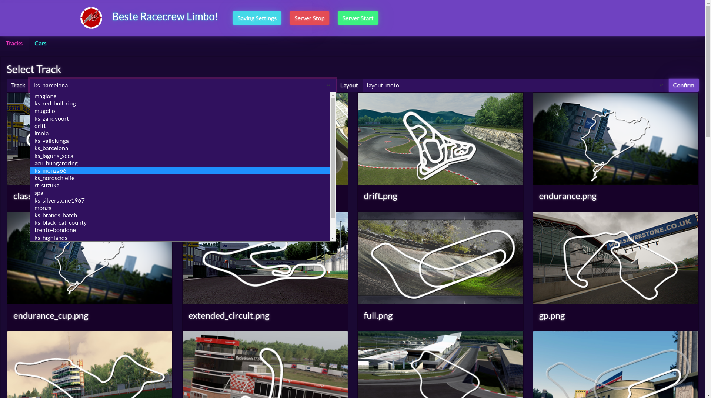

# Description
This is a server manager for the popular racing simulator [Assetto Corsa](https://www.assettocorsa.it/en/).
Gaining insight into player driving- and racetrack statistics is the goal of this project.

If you're not looking for race results analysis, checkout this [server manager made by JustaPenguin](https://github.com/JustaPenguin/assetto-server-manager).

# Screenshots


# Overview
## Features
- [X] Change track
- [X] Start/stop server
- [X] HTTPS support
- [ ] View race results
- [ ] User accounts

## Files
```
 LimAC
 |-- config.py
 |-- content/                           
 |   |-- manager.py                         → Manages Assetto Corsa's race server
 |   |-- runner.py
 |   `-- server/                            → Assetto Corsa server itself
 |-- plotlyflask/                           
 |   `-- plotlydash/                        → Web server
```

# Setup
## Prerequisites
- Linux
- (Tested with) Python 3.10
- Openssl (optional)

## Step By Step
Create a Python venv:
```
$ python -m venv venv_site
$ . ./venv_site/bin/activate
$ python -m pip install --upgrade pip
$ python -m pip install -r requirements.txt
```

Setup SSL certificate (optional):

`$ openssl req -x509 -newkey rsa:4096 -nodes -out cert.pem -keyout key.pem -days 365`

---
Note: When using no certificates (a.k.a. skipping this step), it is required to edit `wsgi.py` and change `ssl_context=('cert.pem', 'key.pem')` to `ssl_context='adhoc'`.
---

Copy the server from Assetto Corsa's installation to `./content`:

`$ cp [...]/SteamLibrary/steamapps/common/assettocorsa/server ./content -r`

Generate track perviews for the website:

```
cd scripts
./gen_all_track_previews.sh [...]/SteamLibrary/steamapps/common/assettocorsa
```

## Running
`$ python wsgi.py` Start the web server.

Then also launch the race server manager:

```
$ cd content
$ python manager.py
```

Now you can checkout the website on `https://127.0.0.1:8050`, the server is available in-game on port `9600`.

# Progress
* [ ] Update package versions in `requirements.txt`
* [ ] Track preview generation: Fix large tracks not showing

## Server Runner
* [ ] Fix web socket (might be overflow or un-flushed buffer)
* [ ] Update server using steamCMD:
    * https://linuxgsm.com/servers/acserver/
    * https://developer.valvesoftware.com/wiki/SteamCMD#Linux_Scripts

## Website
* [X] Intergrate into Flask for HTTPS support
* [ ] Upload mod:
    - Detect track/car/unsupported
* [ ] Support running without Flask to regain the Dash web debugger

### Security ###
* [ ] Implement Flask security measures: https://flask.palletsprojects.com/en/2.0.x/security/
* [ ] Prevent webcrawlers using robots.txt
* [ ] Sanitize client input, e.g. remove escapes from selected track

## AC Server
* [ ] Add SOL weather support
